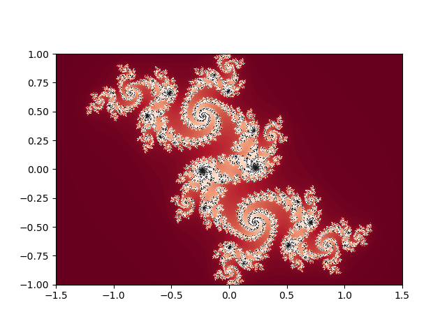
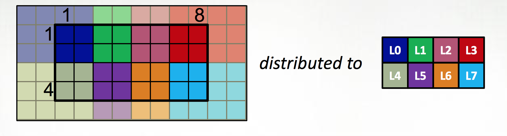

[Julia](https://julialang.org) and [Chapel](http://chapel.cray.com)
are both newish languages aimed at productitive scientific computing,
with parallel computing capabilities baked in from the start.
There's lots of information about both online, but not much comparing
the two.  If you are starting a new scientific computing project
and are willing to try something new, which should you choose?  What
are their strengths and weaknesses, and how do they compare?

Here we walk through a comparison, focusing on distributed-memory
parallelism. Both have strengths in largely disjoint areas.  If you
want matlib-like interactivity and plotting, and master-worker
parallism, Julia is the clear winner; if you want MPI+OpenMPI type
scability on rectangular distributed arrays (dense or sparese),
Chapel is the obvious choice.  Both languages and environments have
clear untapped potential and room to grow; we'll talk about future
prospects of the two languages at the end.

* TOC
{:toc}

## A quick overview of the two languages

### Julia

The [Julia project](https://julialang.org) describes Julia as "a
high-level, high-performance dynamic programming language for
numerical computing."  It exploits type inference of rich types,
just-in-time compilation, and [multiple
dispatch](https://en.wikipedia.org/wiki/Multiple_dispatch) (think
of R, with say `print()` operating differently on scalars,
data&nbsp;frames, or linear regression fits) to provide a dynamic,
interactive, "scripting language"-type high level numerical programming
language that gives performance less than than but competitive with
C or Fortran.

The project sees the language as more or less a matlab-killer, and
so focusses on that sort of interface; interactive, through a REPL
or Jupyter notebook (both available to try [online](https://juliabox.com)),
with integrated plotting; also, indexing begins at one, as God
intended.[^1]

<table style="border: 1px solid black;">
<tbody>
<tr>
<td markdown="span">Example from [David Sanders' SciPy 2014 tutorial](https://github.com/dpsanders/scipy_2014_julia)</td>
<td markdown="span"></td>
</tr>
<tr>
<td>

using PyPlot

# julia set
function julia(z, c; maxiter=200)
    for n = 1:maxiter
        if abs2(z) > 4
            return n-1
        end
        z = z*z + c
    end
    return maxiter
end

jset = [ UInt8(julia(complex(r,i), complex(-.06,.67)))
             for i=1:-.002:-1, r=-1.5:.002:1.5 ];
get_cmap("RdGy")
imshow(jset, cmap="RdGy", extent=[-1.5,1.5,-1,1])

</td>
<td markdown="span">

</td></tr>
</tbody>
</table>

Julia blurs the distinction between scientific users of Julia and
developers in two quite powerful ways.  The first is lisp-like
[metaprogramming](https://docs.julialang.org/en/stable/manual/metaprogramming/),
where julia code can be generated or modified from within Julia,
making it possible to build domain-specific langauges inside Julia
for problems; this allows simple APIs for broad problem sets which
nonetheless take full advantage of the structure of the particular
problems being solved; [JuliaStats](https://github.com/JuliaStats),
[DifferentialEquations.jl](https://github.com/JuliaDiffEq/DifferentialEquations.jl),
[JuliaFEM](https://github.com/JuliaFEM/JuliaFEM.jl), and
[JuMP](https://github.com/JuliaOpt/JuMP.jl) offer hints of what
that could look like.  Another sort of functionality this enables
is [Parallel Accellerator](https://julialang.org/blog/2016/03/parallelaccelerator), an
intel package that can rewrite some regular array operations into
fast, vectorized native code.  This code-is-data aspect of Julia,
combined with the fact that Julia itself is mostly written in Julia,
puts user-written code on an equal footing with almost all "official"
julia code.

The second way Julia blurs the line between user and developer is
the [package system](https://docs.julialang.org/en/stable/manual/packages/)
which uses git and GitHub; this means that once you've installed
someone's package, you're very close to being able to file a pull
request if you find a bug, or to fork the package to specialize
it to your own needs; and it's similarly very easy to
contribute a package if you're already using GitHub to develop the
package.

Julia has support for remote function execution ("out of the box"
using SSH + TCP/IP, but other transports are available through
packages), and distributed rectangular arrays; thread support
is still experimental, and shared-memory on-node arrays somewhat
less so.

Many of Julia's disadvantages are inevitable flip sides of the
advantages.  Because of the dynamic nature of the language and its
reliance on JIT and type inference, it is [still not
possible](https://discourse.julialang.org/t/julia-static-compilation/296/27)
to fully compile a Julia script into a static executable, meaning
that there will be JIT pauses in initial iterations of running code;
too, the dynamic nature of the language relies on garbage collection,
which can cause either GC pauses (and thus jitter at scale) or
unexpected memory pressure throughout execution.  Similarly, the
fact that it's so easy to contribute a package to the Julia package
ecosystem means that the package listing is littered with abandoned
and broken packages.

But some of the disadvantages seem more self-inflicted.  While the
language has been public and actively developed for [over five
years](https://julialang.org/blog/2012/02/why-we-created-julia),
the language is still at v0.6.  While any language will evolve over
time, the Julia community has spent the past five years contininually
re-litigating fairly fundamental decisions of syntax in the interests
of purity -- v0.4 in late 2015 changed the capitalization of unsigned
integer types and radically changed the dictionary syntax, while
0.5 in late 2016 dramatically (although less dramatically than
originally proposed after community pushback) changed the behaviour
of arrays (!!) in an event termed the Arraypocolypse.  As a result,
much example code online simply doesn't work; thus the 
accelerated bitrot of software in the Julia package listing.  This
also makes it difficult to build new functionality on top of base
Julia; it's hard to build powerful parallel computing tools when
one can't even depend on the behavour of arrays.

[^1]: Yes, I said it.  Offsets into buffers rightly begin at 0, and indices into mathematical objects rightly begin at 1; anything else is madness.  Also: oxford comma, two spaces after a period, and vi are all the correct answers to their respective questions.

### Chapel

While Julia is a scientific programming language with parallel computing support,
Chapel is a programming language for parallel scientific computing. It is a 
[PGAS](https://en.wikipedia.org/wiki/Partitioned_global_address_space) language,
with partitioned but globally-accessible variables.  It takes PGAS two steps
further however than languages like [Coarray Fortran](https://www.dursi.ca/post/coarray-fortran-goes-mainstream-gcc-5-1.html),
[UPC](http://upc.lbl.gov), or [X10](http://x10-lang.org), however.

The first extension is to define all large data structures (arrays,
associative arrays, graphs) as being defined over _domains_, and
then definining a library of _domain maps_ for distributing these
domains over different locality regions ("locales") (nodes, or NUMA
nodes) and _layouts_ for describing their layout within a locale.  By
far the best tested and optimized domain maps are for the cases of
dense (and to a lesser extent, CSR-layout sparse) rectangular arrays,
as below, although there support for associative arrays (dictionaries)
and unstructured meshes/graphs as well.

The second is to couple those domain maps with parallel iterators
over the domains, meaning that one can loop over the data in parallel
in one loop (think OpenMP) with a "global view" rather than expressing
the parallelism explicitly as a SIMD-type program.  This decouples
the expression of the layout of the data from the expression of the
calculation over the data, which is essential for productive parallel 
computing; it means that tweaking the layouts (or the dimensionality of
the program, or...) doesn't require rewriting the internals of the
computation.

The distributions and layouts are written in Chapel, so that users can
contribute new domain maps to the project.

<table style="border: 1px solid black;">
<tbody>
<tr> <td markdown="span">
Example from [Chapel tutorial at ACCU 2017](http://chapel.cray.com/tutorials/ACCU2017/06-DomainMaps.pdf)
</td> </tr>
<tr> <td>

var Dom: {1..4, 1..8} dmapped Block({1..4, 1..8});

</td> </tr>
<tr> <td markdown="span">

</td> </tr>
<tr> <td>

var Dom: {1..4, 1..8} dmapped Cyclic(startIdx=(1,1));

</td> </tr>
<tr> <td markdown="span">

</td> </tr>
<tr> <td>

// either case:

var Inner : subdomain(Dom) = {2..3, 2..7};
const north = (-1,0), south = (1,0), east = (0,1), west = (0,-1);

var data, data_new : [Dom] real;
var delta : real;

forall ij in Inner {
    data_new(ij) = (data(ij+north) + data(ij+south)
                    + data(ij+east) + data(ij+west)) / 4.0;
}
delta = max reduce abs(data_new[Dom] - data[Dom]);


</td> </tr>
</tbody>
</table>

Chapel also exposes its lower-level parallel computing functionality ---
such as remote function execution, fork/join task parallelism --- so
that one can write a MPI-like SIMD program by explicity launching 
a function on each core:


coforall loc in Locales do 
    on loc do
        coforall tid in 0..#here.maxTaskPar do
            do_simd_program(loc, tid);


At roughly eight years old as a publically available project, Chapel
is a slightly older and more mature language than Julia. However,
the language continues to evolve and there are breaking changes
between versions; these are much smaller breaking changes than with
Julia, so that most recent example code online works readily.  As
its focus has always been on large-scale parallelism rather than
desktop computing, it is more of a niche project and so has attracted
much less interest and many fewer users than Juli (however, if you
read this blog, Chapel's niche is one you are almost certainly very
interested in.)  The relative paucity of users is reflected in the
smaller number of contributed packages, although an upcoming package
manager will likely lower the bar to future contributions.

Chapel also lacks a REPL, which makes experimentation and testing
somewhat harder --- there's no equivalent of [JuliaBox](https://juliabox.com)
where one can play with the language at a console or in a notebook.
There is an effort in that direction now which may be made easier
by ongoing work on the underlying compiler architecture.

### Similarties and differences 

## Not-explicitly parallel computation

### Linear algebra

### Stencil calculation

### Kmer counting

## Parallel primitives

### Threading

### Remote function execution

### Distributed data

<table>
<thead>
<tr class="header">
<th>Julia</th>
<th>Chapel</th>
</tr>
</thead>
<tbody>
<tr>
<td>

for (i=0; i<10; i++) {
    j += i
}

</td>
<td>

for (i=0; i<10; i++) {
    j += i
}

</td></tr>
<tr>
<td markdown="span">Second column **fields**</td>
<td markdown="span">Some more descriptive text.
</td>
</tr>
</tbody>
</table>

## Julia v Chapel for a 2d diffusion problem

## Julia v Chapel for a distributed bloom filter

## Julia v Chapel for distributed Smith-Waterman

## Strengths and Weaknesses

## Future prospects

