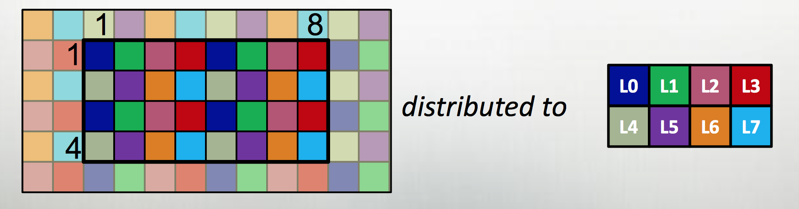

[Julia](https://julialang.org) and [Chapel](http://chapel.cray.com)
are both newish languages aimed at productitive scientific computing,
with parallel computing capabilities baked in from the start.
There's lots of information about both online, but not much comparing
the two.  If you are starting a new scientific computing project
and are willing to try something new, which should you choose?  What
are their strengths and weaknesses, and how do they compare?

Here we walk through a comparison, focusing on distributed-memory
parallelism. Both have strengths in largely disjoint areas.  If you
want matlib-like interactivity and plotting, and need only master-worker
parallelism, Julia is the clear winner; if you want MPI+OpenMPI type
scability on rectangular distributed arrays (dense or sparse),
Chapel is the obvious choice.  Both languages and environments have
clear untapped potential and room to grow; we'll talk about future
prospects of the two languages at the end.

* TOC
{:toc}

## A quick overview of the two languages

### Julia

The [Julia project](https://julialang.org) describes Julia as "a
high-level, high-performance dynamic programming language for
numerical computing."  It exploits type inference of rich types,
just-in-time compilation, and [multiple
dispatch](https://en.wikipedia.org/wiki/Multiple_dispatch) (think
of R, with say `print()` defined to operate differently on scalars,
data&nbsp;frames, or linear regression fits) to provide a dynamic,
interactive, "scripting language"-type high level numerical programming
language that gives performance less than than but competitive with
C or Fortran.

The project sees the language as more or less a matlab-killer, and
so focusses on that sort of interface; interactive, through a REPL
or Jupyter notebook (both available to try [online](https://juliabox.com)),
with integrated plotting; also, indexing begins at one, as God
intended.[^1]

[^1]: Yes, I said it.  Offsets into buffers can begin at 0, sure, but indices into mathematical objects begin at 1; anything else is madness.  Also: oxford comma, two spaces after a period, and vi are all the correct answers to their respective questions.

<table style="border: 1px solid black;">
<tbody>
<tr>
<td markdown="span">Example from [David Sanders' SciPy 2014 tutorial](https://github.com/dpsanders/scipy_2014_julia)</td>
<td markdown="span"></td>
</tr>
<tr>
<td>

using PyPlot

# julia set
function julia(z, c; maxiter=200)
    for n = 1:maxiter
        if abs2(z) > 4
            return n-1
        end
        z = z*z + c
    end
    return maxiter
end

jset = [ UInt8(julia(complex(r,i), complex(-.06,.67)))
             for i=1:-.002:-1, r=-1.5:.002:1.5 ];
get_cmap("RdGy")
imshow(jset, cmap="RdGy", extent=[-1.5,1.5,-1,1])

</td>
<td markdown="span">

</td></tr>
</tbody>
</table>

Julia blurs the distinction between scientific users of Julia and
developers in two quite powerful ways.  The first is lisp-like
[metaprogramming](https://docs.julialang.org/en/stable/manual/metaprogramming/),
where julia code can be generated or modified from within Julia,
making it possible to build domain-specific langauges (DSLs) inside Julia
for problems; this allows simple APIs for broad problem sets which
nonetheless take full advantage of the structure of the particular
problems being solved; [JuliaStats](https://github.com/JuliaStats),
[DifferentialEquations.jl](https://github.com/JuliaDiffEq/DifferentialEquations.jl),
[JuliaFEM](https://github.com/JuliaFEM/JuliaFEM.jl), and
[JuMP](https://github.com/JuliaOpt/JuMP.jl) offer hints of what
that could look like.  Another sort of functionality this enables
is [Parallel Accellerator](https://julialang.org/blog/2016/03/parallelaccelerator), an
intel package that can rewrite some regular array operations into
fast, vectorized native code.  This code-is-data aspect of Julia,
combined with the fact that Julia itself is mostly written in Julia,
puts user-written code on an equal footing with almost all "official"
julia code.

The second way Julia blurs the line between user and developer is
the [package system](https://docs.julialang.org/en/stable/manual/packages/)
which uses git and GitHub; this means that once you've installed
someone's package, you're very close to being able to file a pull
request if you find a bug, or to fork the package to specialize
it to your own needs; and it's similarly very easy to
contribute a package if you're already using GitHub to develop the
package.

Julia has support for remote function execution ("out of the box"
using SSH + TCP/IP, but other transports are available through
packages), and distributed rectangular arrays; thread support
is still experimental, and shared-memory on-node arrays somewhat
less so.

### Chapel

While Julia is a scientific programming language with parallel
computing support, Chapel is a programming language for parallel
scientific computing. It is a [PGAS](https://en.wikipedia.org/wiki/Partitioned_global_address_space)
language, with partitioned but globally-accessible variables, using
[GASNet](https://gasnet.lbl.gov) for communications.  It takes PGAS
two steps further however than languages like [Coarray
Fortran](https://www.dursi.ca/post/coarray-fortran-goes-mainstream-gcc-5-1.html),
[UPC](http://upc.lbl.gov), or [X10](http://x10-lang.org), however.

The first extension is to define all large data structures (arrays,
associative arrays, graphs) as being defined over _domains_, and
then definining a library of _domain maps_ for distributing these
domains over different locality regions ("locales") (nodes, or NUMA
nodes, or KNL accellerators) and _layouts_ for describing their layout
within a locale.  By far the best tested and optimized domain maps
are for the cases of dense (and to a lesser extent, CSR-layout
sparse) rectangular arrays, as below, although there support for
associative arrays (dictionaries) and unstructured meshes/graphs
as well.

The second is to couple those domain maps with parallel iterators
over the domains, meaning that one can loop over the data in parallel
in one loop (think OpenMP) with a "global view" rather than expressing
the parallelism explicitly as a SIMD-type program.  This decouples
the expression of the layout of the data from the expression of the
calculation over the data, which is essential for productive parallel 
computing; it means that tweaking the layouts (or the dimensionality of
the program, or...) doesn't require rewriting the internals of the
computation.

The distributions and layouts are written in Chapel, so that users can
contribute new domain maps to the project.

<table style="border: 1px solid black;">
<tbody>
<tr> <td markdown="span">
Example from [Chapel tutorial at ACCU 2017](http://chapel.cray.com/tutorials/ACCU2017/06-DomainMaps.pdf)
</td> </tr>
<tr> <td>

var Dom: {1..4, 1..8} dmapped Block({1..4, 1..8});

</td> </tr>
<tr> <td markdown="span">

</td> </tr>
<tr> <td>

var Dom: {1..4, 1..8} dmapped Cyclic(startIdx=(1,1));

</td> </tr>
<tr> <td markdown="span">

</td> </tr>
<tr> <td>

// either case:

var Inner : subdomain(Dom) = {2..3, 2..7};
const north = (-1,0), south = (1,0), east = (0,1), west = (0,-1);

var data, data_new : [Dom] real;
var delta : real;

forall ij in Inner {
    data_new(ij) = (data(ij+north) + data(ij+south)
                    + data(ij+east) + data(ij+west)) / 4.0;
}
delta = max reduce abs(data_new[Dom] - data[Dom]);


</td> </tr>
</tbody>
</table>

Chapel also exposes its lower-level parallel computing functionality ---
such as remote function execution, fork/join task parallelism --- so
that one can write a MPI-like SIMD program by explicity launching 
a function on each core:


coforall loc in Locales do 
    on loc do
        coforall tid in 0..#here.maxTaskPar do
            do_simd_program(loc, tid);


At roughly eight years old as a publically available project, Chapel
is a slightly older and more mature language than Julia. However,
the language continues to evolve and there are breaking changes
between versions; these are much smaller and more localized breaking
changes than with Julia, so that most recent example code online
works readily.  As its focus has always been on large-scale parallelism
rather than desktop computing, it is more of a niche project and
so has attracted much less interest and many fewer users than Julia
(however, if you read this blog, Chapel's niche is one you are
almost certainly very interested in.)  The relative paucity of users
is reflected in the smaller number of contributed packages, although
an upcoming package manager will likely lower the bar to future
contributions.

Chapel also lacks a REPL, which makes experimentation and testing
somewhat harder --- there's no equivalent of [JuliaBox](https://juliabox.com)
where one can play with the language at a console or in a notebook.
There is an effort in that direction now which may be made easier
by ongoing work on the underlying compiler architecture.

## Similarities and differences

### Standard library

Both [Julia](https://docs.julialang.org/en/stable) and [Chapel](http://chapel.cray.com/docs/latest/)
have good documentation, and the basic modules or capabilities one would expect from languages 
aimed at technical computing:

- Complex numbers 
- Mathematical function libraries
- Random numbers
- Linear algebra
- FFTs
- C, Python interoperability
- Multi-precision floats / BigInts
- MPI interoperability
- Profiling

although there are differences - in Julia, Python interoperability
is much more complete (the Julia set example above used matplotlib
plotting, while [pychapel](https://pychapel.readthedocs.io) focuses
on calling Chapel from within python).  Also, Julia's linear algebra
support is much slicker, styled after Matlab syntax and with a rich
set of matrix types (symmetric, tridiagonal, _etc._), so that for
linear solves, say, a sensible method is chosen automatically; the
consise syntax and "do the right thing" approach are particularly
helpful for interactive use[^2], which is a primary use-case of Julia.

[^2]: "Do the right thing" isn't free, however; as with matlab or numpy, when combining objects of different shapes or sizes, the "right thing" can be a bit suprising unless one is very familiar with the tool's [broadcasting rules](https://docs.julialang.org/en/stable/manual/arrays/?highlight=broadcasting#broadcasting)

On profiling, the Julia support is primariy for serial profiling
and text based; Chapel has a very nice tool called
[chplvis](http://chapel.cray.com/docs/1.14/tools/chplvis/chplvis.html) 
for visualizing parallel performance.

### Other packages

Julia's early adoption of a package management framework and very
large initial userbase has lead to a [very large ecosystem](http://pkg.julialang.org)
of contributed packages.  As with all such package ecosystems, 
the packages themselves are a bit of a mixed bag -- lots are broken or
abandoned, many are simply wrappers to other tools -- but there
are also excellent, substantial packages of immediate interest
to those doing scientific computing, such as 
[DifferentialEquations.jl](https://github.com/JuliaDiffEq/DifferentialEquations.jl)
for ODEs, SDEs, and and FEM for some PDEs,
[BioJulia](https://github.com/BioJulia) for bioinformatics,
and [JuliaStats](http://juliastats.github.io) for R-like
statistical computing.  The julia project would benefit from
having a more curated view of the package listings easily available
so that these high-quality tools were more readily visible to
new users.

On the other hand, there are almost no packages available for Chapel
outside of the main project.  There are efforts to develop a package
manager inspired by cargo (Rust) and glide (Go); this would be an
important and needed development, almost certainly necessary
to grow the Chapel community.

### Language features

The biggest language feature difference is undoubtedly
Julia's JIT-powered metaprogramming capabilities; Chapel 
is a more traditional compiled language.  A small downside
of Julia's JIT approach is that functions are often slow the
first time they are called, as they must be compiled.

Beyond that, Julia and Chapel are both quite new and have functionality
one might expect in a modern language: first class functions, lambda
functions, type inference, iterators, ranges, coroutines, futures,
and JuliaDoc/chpldoc python packages for generating online documentation
from source code and embedded comments.

More minor but something that quickly comes up: there's difference
in command-line argument handling which reflects the use
cases each team finds important.  Both give access to an argv-like array of
strings passed to the command line; in base Julia with its interactive
nature, that's it (although there's a nice python-argparse inspired
[contributed package](http://carlobaldassi.github.io/ArgParse.jl/latest/)),
while in Chapel, intended to make compiled long-running executables
one can define a constant (`const n = 10;`) and make it settable
on the command line by changing the `const` to `config` and running
the program with `-n 20`.

## Simple computational tasks

### Linear algebra

### Stencil calculation

### Kmer counting

## Parallel primitives

### Threading

### Remote function execution

### Master-worker parallelism

### Distributed data

## Julia v Chapel for a 2d diffusion problem

## Julia v Chapel for a distributed bloom filter

## Julia v Chapel for distributed Smith-Waterman

## Strengths, Weaknesses, and Future Prospects

Both Julia and Chapel are perfectly useable today for problems that
fall within their current bailiwicks, at least for advanced users.
They are strong projects and interesting technologies.  In addition,
both have significant potential and "room to grow" beyond their
current capabilities; but both face challenges as well.

### Julia

Julia's great flexibility - the metaprogramming and the type system
in particular - gives it a very real opportunity to become a platform
on which many domanin-specific language are written for particular scientific problems.
We see some of that potential in tools like [DifferentialEquations.jl](https://github.com/JuliaDiffEq/DifferentialEquations.jl),
where a simple, general API can nonetheless be used to provide efficient
solutions to a problems that span a wide range of regimes and structures;
the `solve()` function and the problem definition language essentially
becomes a DSL for a wide range of differential equation problems.
And Julia's interactive and dynamic nature makes it a natural for 
scientists noodling around on problems, performing numerical
experiments and looking at the results.  While large-scale computing
--- in an HPC or Spark-style Big-data sense --- is not a forte of
Julia's right now, the basic pieces are there and it certainly could
be in the near future.

Many of Julia's disadvantages are inevitable flip sides of some of
those advantages.  advantages.  Because of the dynamic nature of
the language and its reliance on JIT and type inference, it is
[still not
possible](https://discourse.julialang.org/t/julia-static-compilation/296/27)
to fully compile a Julia script into a static executable, meaning
that there will be JIT pauses in initial iterations of running code;
too, the dynamic nature of the language relies on garbage collection,
which can cause either GC pauses (and thus jitter at scale) or
unexpected memory pressure throughout execution.  Similarly, the
fact that it's so easy to contribute a package to the Julia package
ecosystem means that the package listing is littered with abandoned
and broken packages.

But some of the disadvantages seem more self-inflicted.  While the
language has been public and actively developed for [over five
years](https://julialang.org/blog/2012/02/why-we-created-julia),
the language is still at v0.6.  While any language will evolve over
time, the Julia community has spent the past five years contininually
re-litigating fairly fundamental decisions of syntax in the interests
of purity -- v0.4 in late 2015 changed the capitalization of unsigned
integer types and radically changed the dictionary syntax, while
0.5 in late 2016 dramatically (although less dramatically than
originally proposed after community pushback) changed the behaviour
of arrays (!!) in an event termed the Arraypocolypse.  As a result,
much example code online simply doesn't work; thus the 
accelerated bitrot of software in the Julia package listing.  This
also makes it difficult to build new functionality on top of base
Julia; it's hard to build powerful parallel computing tools when
one can't even depend on the behavour of arrays.

So Julia living up to that potential is not a given.  If I were on
Julia's project team, things that would concern me would include:

**Peak Julia?**
: Julia grew very quickly early on, but since then seems to have topped out;
for example, [flat google trends interest](https://g.co/trends/qzmA9),
[declining interest on stack
overflow](https://insights.stackoverflow.com/trends?tags=julia-lang), and
falling off the radar of "languages to watch" lists such as the
[Redmonk language
rankings](http://redmonk.com/sogrady/2017/03/17/language-rankings-1-17/). 
This may be unfair. These trends may say more about the large initial
surge of interest than stagnation or decline; "a hugely popular
scientific programing language" almost seems like an oxymoron, after all.
A five-year old language for numerical computing that still hasn't
reached 1.0 but has popularity comparable to Rust (which started
at the same time but is a more general systems-programming language)
or Fortran (which has an enormous installed base) is pretty remarkable;
further growth may simply be more modest simply because of the small
size of the number of scientific programmers out there.  Still, I
think one would want to see interest growing ahead of a 1.0 release,
rather than flat or declining.

**Instability driving off users, developers**
: Very early on, community members who used Julia started building
what became [JuliaStats](http://juliastats.github.io), with R-like
data frames, data tables, random distributions, and a growing number
of statistics and machine-learning tools built atop.  This took
significant developer effort, as fundamental to statistical use
cases is "Not Available" or "NA" values, with semantics different
from the NaNs that we in the simulation computing community are so
frequently (if usually unintentionally) familar with.  Thus dataframes
and tables couldn't simply be built directly on top of numerical
arrays of basic numerical types, but took some effort to build
efficient "nullable" types atop of.  But partly because of instability
in the underlying language, Julia DataFrames and DataArrays have
themselves been under flux, which is show-stopping to R users
considering Julia, and demoralizing to developers.  Many other similar
examples exist in other domains.  If it is true that there is
declining or stagnant interest in Julia, this would certainly be a
contributing factor.

**The JIT often needs help, even for basic numerical computing tasks**
: Julia is designed around its JIT compiler, which enables some
of the language's very cool features - the metaprogramming, the
dynamic nature of the language, the interactivity.  But the JIT
compiler often needs a lot of help to get reasonable performance.
For instance, writing numerical operations in the more readable
vectorized form (like for the stream example in Chapel, `C = A + B`
rather than looping over the indices) [has long been slow in Julia](http://www.johnmyleswhite.com/notebook/2013/12/22/the-relationship-between-vectorized-and-devectorized-code/)
and still is [unless special meaures are taken](https://julialang.org/blog/2017/01/moredots).
[A third party package](http://parallelacceleratorjl.readthedocs.io/en/latest/index.html)
exists which helps many of the common cases (speeding up stencil
operations on rectangular arrays), which on one hand indicates the
power of Julia metaprogramming capabilities.  But on the other, one
might naturally think that fast numerical operations on arrays would
be something that the core language came with.  Part of the problem here
is that while the Julia ecosystem broadly has a very large number of
contributors, the core language internals (like the JIT itself) 
has only a handful, and complex issues like performance can take a very long time
to get solved.

**The 800lb pythonic gorilla**
: Python is enormously popular in scientific and data-science type
applications, has huge installed base and number of packages, and
with [numpy](http://www.numpy.org) and [numba](http://numba.pydata.org)
can be quite fast.  The scientific computing community is now 
grudgingly starting to move to Python 3, and with Python 3.5+ 
supporting [type annotations](https://docs.python.org/3/library/typing.html),
I think there'd start to be a quite real concern that Python would get
Julia-fast (or close enough) before Julia got Python-big.  The fact
that some of Julia's nicest features like notebook support and coolest new projects
like [Dagger](https://github.com/JuliaParallel/Dagger.jl) rely on
or are ports of work originally done for Python (ipython notebook
and [Dask](http://dask.pydata.org/en/latest/)) indicate the danger
if Python gets fast enough.

Of those four, only the middle two are completely under the Julia
team's control; a v1.0 released soon, and with solemn oaths sworn
to have no more significant breaking changes until v2.0 would help
developers and users, and onboarding more people into core internals
development would help the underlying technology.

### Chapel

If I were on the Chapel team, my concerns would be different:

**Adoption**
: It's hard to escape the fact that Chapel's user base is very
small.  The good news is that Chapel's niche, unlike Julia's, has
no serious immediate competitor, which gives it a bit more runway ---
I'd consider other productive parallel scientific programming
languages to be more research projects than products.  But the niche
itself is small, and Chapel's modest adoption rate within that niche
needs to be addressed in the near future if the language is to
thrive.  The Chapel team is doing many of the right things ---  the
package is easy to install (no small feat for a performant parallel
programming language); the compiler is getting faster and producing
faster code; there's lots of examples, tutorials and documentation
available; and the community is extremely friendly and welcoming
--- but it seems clear that users need to be given more reason to
start trying the language.

**Small number of external contributors**
: Admittedly, this is related to the fact that the number of users
is small, but it's also the case that contributing code is nontrivial
if you want to contribute it to the main project, and there's no central
place where other people could look for your work if you wanted to have
it as an external package.  A package manager would be a real help, 
and it doens't have to be elaborate (especially in the initial version).

**Not enough packages**
: In turn, this is caused by the small number of external contributors,
and helps keep the adoption low.  Chapel already has the fundamentals
to start building some really nice higher-level packages and solvers
that would make it easy to start writing some types of scientific
codes.  A distributed-memory n-dimensional FFT over one of its
domains; the beginnings of a Chapel-native set of solvers from
[Scalapack](http://www.netlib.org/scalapack/) or
[PETSc](http://www.mcs.anl.gov/petsc/index.html) (both of which are
notoriously hard to get started with, and in PETSc's case, even
install); simple static-sized R-style dataframes with some analysis
routines; these are tools which would make it very easy to get
started writing some non-trivial scientific software in Chapel.

**Too few domain maps and layouts**
: Being able to, in a few lines of code, write performant, threaded,
NUMA-aware, and distributed memory operations on statically-decomposed
rectangular multidimensional arrays, and have that code work on a
cluster or your desktop is amazing.  But many scientific problems
do not match neatly onto these domains.  Many require dynamically-sized
domains (block-adaptive meshes) or load balancing (tree codes,
dynamic hash tables); others may be static but not quite look like
CSR-sparse arrays.  Domain maps, layouts, and the parallel iterators
which loop over them are the "secret sauce" of Chapel, and can be
written in user code if the underlying capabilities they need are
supported, so they can be contributed externally, but there is little
documention/examples (compared to that on using existing domain maps) available.

The good news is that these items are all under the Chapel community's
control.  

## My conclusion

---
