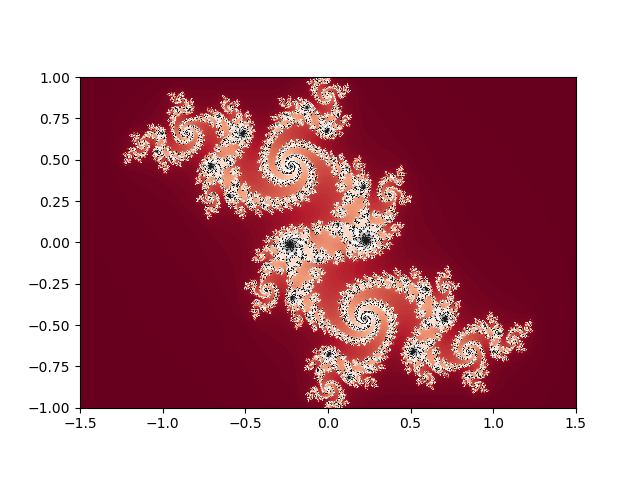
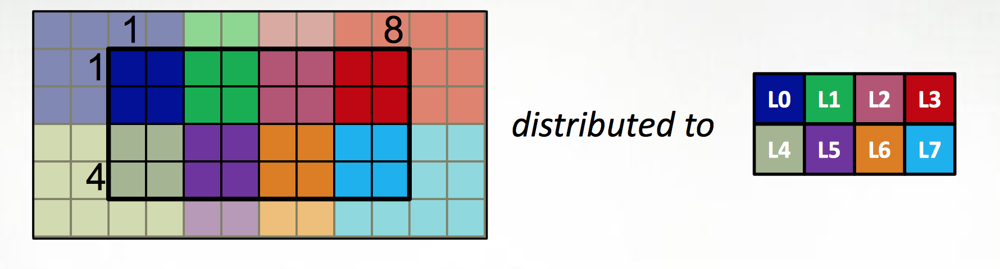
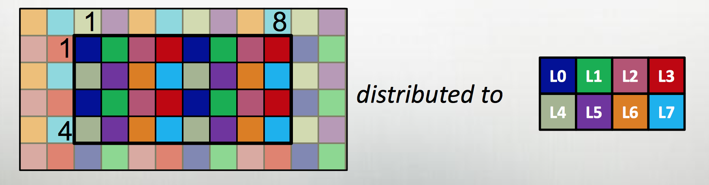
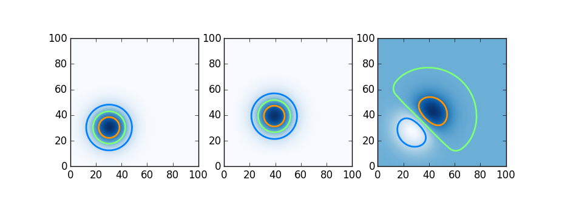

[Julia](https://julialang.org) and [Chapel](http://chapel.cray.com)
are both newish languages aimed at productitive scientific computing,
with parallel computing capabilities baked in from the start.
There's lots of information about both online, but not much comparing
the two.  If you are starting a new scientific computing project
and are willing to try something new, which should you choose?  What
are their strengths and weaknesses, and how do they compare?

Here we walk through a comparison, focusing on distributed-memory
parallelism of the sort one would want for HPC-style simulation.
Both have strengths in largely disjoint areas.  If you want matlib-like
interactivity and plotting, and need only master-worker parallelism,
Julia is the clear winner; if you want MPI+OpenMPI type scability
on rectangular distributed arrays (dense or sparse), Chapel wins
handily.  Both languages and environments have clear untapped
potential and room to grow; we'll talk about future prospects of
the two languages at the end.

* TOC
{:toc}

## A quick overview of the two languages

### Julia

The [Julia project](https://julialang.org) describes Julia as "a
high-level, high-performance dynamic programming language for
numerical computing."  It exploits type inference of rich types,
just-in-time compilation, and [multiple
dispatch](https://en.wikipedia.org/wiki/Multiple_dispatch) (think
of R, with say `print()` defined to operate differently on scalars,
data&nbsp;frames, or linear regression fits) to provide a dynamic,
interactive, "scripting language"-type high level numerical programming
language that gives performance less than than but competitive with
C or Fortran.

The project sees the language as more or less a matlab-killer, and
so focusses on that sort of interface; interactive, through a REPL
or Jupyter notebook (both available to try [online](https://juliabox.com)),
with integrated plotting; also, indexing begins at one, as God
intended.[^1]

[^1]: Yes, I said it.  Offsets into buffers can begin at 0, sure, but indices into mathematical objects begin at 1; anything else is madness.  Also: oxford comma, two spaces after a period, and vi are all the correct answers to their respective questions.

<table style="border: 1px solid black;">
<tbody>
<tr>
<td markdown="span">Example from [David Sanders' SciPy 2014 tutorial](https://github.com/dpsanders/scipy_2014_julia)</td>
<td markdown="span"></td>
</tr>
<tr>
<td>

using PyPlot

# julia set
function julia(z, c; maxiter=200)
    for n = 1:maxiter
        if abs2(z) > 4
            return n-1
        end
        z = z*z + c
    end
    return maxiter
end

jset = [ UInt8(julia(complex(r,i), complex(-.06,.67)))
             for i=1:-.002:-1, r=-1.5:.002:1.5 ];
get_cmap("RdGy")
imshow(jset, cmap="RdGy", extent=[-1.5,1.5,-1,1])

</td>
<td markdown="span">

</td></tr>
</tbody>
</table>

Julia blurs the distinction between scientific users of Julia and
developers in two quite powerful ways.  The first is lisp-like
[metaprogramming](https://docs.julialang.org/en/stable/manual/metaprogramming/),
where julia code can be generated or modified from within Julia,
making it possible to build domain-specific langauges (DSLs) inside Julia
for problems; this allows simple APIs for broad problem sets which
nonetheless take full advantage of the structure of the particular
problems being solved; [JuliaStats](https://github.com/JuliaStats),
[DifferentialEquations.jl](https://github.com/JuliaDiffEq/DifferentialEquations.jl),
[JuliaFEM](https://github.com/JuliaFEM/JuliaFEM.jl), and
[JuMP](https://github.com/JuliaOpt/JuMP.jl) offer hints of what
that could look like.  Another sort of functionality this enables
is [Parallel Accellerator](https://julialang.org/blog/2016/03/parallelaccelerator), an
intel package that can rewrite some regular array operations into
fast, vectorized native code.  This code-is-data aspect of Julia,
combined with the fact that much of Julia itself is written in Julia,
puts user-written code on an equal footing with much "official"
julia code.

The second way Julia blurs the line between user and developer is
the [package system](https://docs.julialang.org/en/stable/manual/packages/)
which uses git and GitHub; this means that once you've installed
someone's package, you're very close to being able to file a pull
request if you find a bug, or to fork the package to specialize
it to your own needs; and it's similarly very easy to
contribute a package if you're already using GitHub to develop the
package.

Julia has support for remote function execution ("out of the box"
using SSH + TCP/IP, but other transports are available through
packages), and distributed rectangular arrays; thread support
is still experimental, as is shared-memory on-node arrays.

### Chapel

While Julia is a scientific programming language with parallel
computing support, Chapel is a programming language for parallel
scientific computing. It is a [PGAS](https://en.wikipedia.org/wiki/Partitioned_global_address_space)
language, with partitioned but globally-accessible variables, using
[GASNet](https://gasnet.lbl.gov) for communications.  It takes PGAS
two steps further however than languages like [Coarray
Fortran](https://www.dursi.ca/post/coarray-fortran-goes-mainstream-gcc-5-1.html),
[UPC](http://upc.lbl.gov), or [X10](http://x10-lang.org), however.

The first extension is to define all large data structures (arrays,
associative arrays, graphs) as being defined over _domains_, and
then definining a library of _domain maps_ for distributing these
domains over different locality regions ("locales") (nodes, or NUMA
nodes, or KNL accellerators) and _layouts_ for describing their layout
within a locale.  By far the best tested and optimized domain maps
are for the cases of dense (and to a lesser extent, CSR-layout
sparse) rectangular arrays, as below, although there support for
associative arrays (dictionaries) and unstructured meshes/graphs
as well.

The second is to couple those domain maps with parallel iterators
over the domains, meaning that one can loop over the data in parallel
in one loop (think OpenMP) with a "global view" rather than expressing
the parallelism explicitly as a SIMD-type program.  This decouples
the expression of the layout of the data from the expression of the
calculation over the data, which is essential for productive parallel 
computing; it means that tweaking the layouts (or the dimensionality of
the program, or...) doesn't require rewriting the internals of the
computation.

The distributions and layouts are written in Chapel, so that users can
contribute new domain maps to the project.

<table style="border: 1px solid black;">
<tbody>
<tr> <td markdown="span">
Example from [Chapel tutorial at ACCU 2017](http://chapel.cray.com/tutorials/ACCU2017/06-DomainMaps.pdf)
</td> </tr>
<tr> <td>

var Dom: {1..4, 1..8} dmapped Block({1..4, 1..8});

</td> </tr>
<tr> <td markdown="span">

</td> </tr>
<tr> <td>

var Dom: {1..4, 1..8} dmapped Cyclic(startIdx=(1,1));

</td> </tr>
<tr> <td markdown="span">

</td> </tr>
<tr> <td>

// either case:

var Inner : subdomain(Dom) = {2..3, 2..7};
const north = (-1,0), south = (1,0), east = (0,1), west = (0,-1);

var data, data_new : [Dom] real;
var delta : real;

forall ij in Inner {
    data_new(ij) = (data(ij+north) + data(ij+south)
                    + data(ij+east) + data(ij+west)) / 4.0;
}
delta = max reduce abs(data_new[Dom] - data[Dom]);


</td> </tr>
</tbody>
</table>

Chapel also exposes its lower-level parallel computing functionality ---
such as remote function execution, fork/join task parallelism --- so
that one can write a MPI-like SIMD program by explicity launching 
a function on each core:


coforall loc in Locales do 
    on loc do
        coforall tid in 0..#here.maxTaskPar do
            do_simd_program(loc, tid);


At roughly eight years old as a publically available project, Chapel
is a slightly older and more mature language than Julia. However,
the language continues to evolve and there are breaking changes
between versions; these are much smaller and more localized breaking
changes than with Julia, so that most recent example code online
works readily.  As its focus has always been on large-scale parallelism
rather than desktop computing, its potential market is smaller
so has attracted less interest and fewer users than Julia
--- however, if you read this blog, Chapel's niche is one you are
almost certainly very interested in.  The relative paucity of users
is reflected in the smaller number of contributed packages, although
an upcoming package manager will likely lower the bar to future
contributions.

Chapel also lacks a REPL, which makes experimentation and testing
somewhat harder --- there's no equivalent of [JuliaBox](https://juliabox.com)
where one can play with the language at a console or in a notebook.
There is an effort in that direction now which may be made easier
by ongoing work on the underlying compiler architecture.

## Similarities and differences

### Standard library

Both [Julia](https://docs.julialang.org/en/stable) and [Chapel](http://chapel.cray.com/docs/latest/)
have good documentation, and the basic modules or capabilities one would expect from languages 
aimed at technical computing:

- Complex numbers 
- Mathematical function libraries
- Random numbers
- Linear algebra
- FFTs
- C, Python interoperability
- Multi-precision floats / BigInts
- MPI interoperability
- Profiling

although there are differences - in Julia, Python interoperability
is much more complete (the Julia set example above used matplotlib
plotting, while [pychapel](https://pychapel.readthedocs.io) focuses
on calling Chapel from within python).  Also, Julia's linear algebra
support is much slicker, styled after Matlab syntax and with a rich
set of matrix types (symmetric, tridiagonal, _etc._), so that for
linear solves, say, a sensible method is chosen automatically; the
consise syntax and "do the right thing" approach are particularly
helpful for interactive use[^2], which is a primary use-case of Julia.

[^2]: "Do the right thing" isn't free, however; as with matlab or numpy, when combining objects of different shapes or sizes, the "right thing" can be a bit suprising unless one is very familiar with the tool's [broadcasting rules](https://docs.julialang.org/en/stable/manual/arrays/?highlight=broadcasting#broadcasting)

On profiling, the Julia support is primariy for serial profiling
and text based; Chapel has a very nice tool called
[chplvis](http://chapel.cray.com/docs/1.14/tools/chplvis/chplvis.html) 
for visualizing parallel performance.

### Other packages

Julia's early adoption of a package management framework and very
large initial userbase has lead to a [very large ecosystem](http://pkg.julialang.org)
of contributed packages.  As with all such package ecosystems, 
the packages themselves are a bit of a mixed bag -- lots are broken or
abandoned, many are simply wrappers to other tools -- but there
are also excellent, substantial packages taking full advantage of
Julia's capabalities that are of immediate interest
to those doing scientific computing, such as 
[DifferentialEquations.jl](https://github.com/JuliaDiffEq/DifferentialEquations.jl)
for ODEs, SDEs, and and FEM for some PDEs,
[BioJulia](https://github.com/BioJulia) for bioinformatics,
[JuliaDiff](http://www.juliadiff.org) for automatic differentiation,
and [JuliaStats](http://juliastats.github.io) for R-like
statistical computing.  The julia project would benefit from
having a more curated view of the package listings easily available
so that these high-quality tools were more readily visible to
new users.

On the other hand, there are almost no packages available for Chapel
outside of the main project.  There are efforts to develop a package
manager inspired by cargo (Rust) and glide (Go); this would be an
important and needed development, almost certainly necessary
to grow the Chapel community.

### Language features

The biggest language feature difference is undoubtedly Julia's
JIT-powered metaprogramming capabilities; Chapel is a more traditional
compiled language.  A small downside of Julia's JIT approach is
that functions are often slow the first time they are called, as
they must be compiled.  Relatedly, Julia is garbage-collected, which
can lead to pauses and memory pressure at unexpected times.  On
the other hand, Chapel's compile time, which is still quite long 
even compared to other compilers, makes the development cycle much 
slower than it would be with Julia or Python.

Beyond that, Julia and Chapel are both quite new and have functionality
one might expect in a modern language: first class functions, lambda
functions, comprehensions, keyword/optional parameters, type
inference, iterators, ranges, coroutines and green threads, futures,
and JuliaDoc/chpldoc python packages for generating online documentation
from source code and embedded comments.

More minor but something that quickly comes up: there's difference
in command-line argument handling which reflects the use
cases each team finds important.  Both give access to an argv-like array of
strings passed to the command line; in base Julia with its interactive
nature, that's it (although there's a nice python-argparse inspired
[contributed package](http://carlobaldassi.github.io/ArgParse.jl/latest/)),
while in Chapel, intended to make compiled long-running executables
one can define a constant (`const n = 10;`) and make it settable
on the command line by changing the `const` to `config` and running
the program with `-n 20`.

## Simple computational tasks

Here we take a look at a couple common single-node scientific
computation primitives in each framework (with Python for comparison)
to compare the language features.  Full code for the examples are
available [on GitHub](http://www.github.com/ljdursi/julia_v_chapel).

### Linear algebra

For linear algebra operations, Julia's matlab lineage and
interactive really shine:

<table style="border: 1px solid black;">
<tbody>
<tr><td markdown="span">**Julia**</td>
<td>

# ...
n = 500
B = rand(n, n)
x = rand(n)

A = x*x'
y = B*x

println(A[1,1])

A = eye(n)
y = A\x

println(sum(abs.(x-y)))
# ...

</td></tr>
<tr><td markdown="span">**Chapel**</td>
<td>

use LinearAlgebra;
use LAPACK;
use Random;

config const n=500;

var A = Matrix(n, n),
    B = Matrix(n, n),
    x, y = Vector(n);

fillRandom(B);
fillRandom(x);

y = dot(B, x);
A = outer(x, y);

writeln(A[1,1]);

var X = Matrix(n,1);
var Y = Matrix(n,1);
X({1..n},1) = x({1..n});

A = eye(n);
var ipiv : [1..n] c_int;
Y = X;
var info = gesv(lapack_memory_order.row_major, A, ipiv, Y);

var res = + reduce abs(x-y);

writeln(res);

</td></tr>
<tr><td markdown="span">**Python**</td>
<td>

from __future__ import print_function
import numpy as np

n = 500
B = np.random.rand(500, 500)
x = np.random.rand(500)

A = np.outer(x, np.transpose(x))
y = np.dot(B, x)

print(A[0,0])

A = np.eye(n)
y = np.linalg.solve(A, x)

print(np.sum(np.abs(x-y)))

</td></tr>
</tbody>
</table>

The new Chapel `LinearAlgebra` and `LAPACK` modules don't really 
work well together yet, so one has to awkwardly switch between
the two idioms, but that's readily easily fixed.  Julia's nice
matrix type system allows "do the right-thing" type linear solves,
which is incredibly handy for interactive work, although for a 
compiled program that will be used repeatedly, the clarity of
specifying a specific solver (which Julia also allows) is probably
advantageous.

### Stencil calculation

Below we take a look at a simple 1-d explicit heat diffusion equation,
requiring a small stencil, and see how it compares across the languges.

<table style="border: 1px solid black;">
<tbody>
<tr><td markdown="span">**Julia**</td>
<td>

# ...
for i in 2:ngrid+1
  temp[i] = 0.
end

temp[1] = tleft
temp[ngrid+2] = tright

for iteration in 1:ntimesteps
  for i in 2:ngrid+1
      temp_new[i] = temp[i] + kappa*dt/(dx*dx)*
                      (temp[i-1] - 2*temp[i] + temp[i+1])
  end
  for i in 2:ngrid+1
      temp[i] = temp_new[i]
  end
end
# ...

</td></tr>
<tr><td markdown="span">**Chapel**</td>
<td>

// ...
const ProblemSpace = {1..ngrid},
      BigDomain = {0..ngrid+1};
var T, TNew: [BigDomain] real(64) = 0.0;

var iteration = 0;
T[0] = tleft;
T[ngrid+1] = tright;

const left = -1, right = 1;

for iteration in 1..ntimesteps {
  forall i in ProblemSpace {
    TNew(i) = T(i) + kappa*dt/(dx*dx) *
          (T(i+left) - 2*T(i) + T(i+right));
  }
  T[ProblemSpace] = TNew[ProblemSpace];
}
// ...

</td></tr>
<tr><td markdown="span">**Python**</td>
<td>

# ...
@jit('f8[:](i4, i4, f8, f8, f8, f8, f8)', nopython=True)
def onedheat(ngrid, ntimesteps, kappa, xleft, xright, tleft, tright):
    dx = (xright-xleft)/(ngrid-1)
    dt = 0.25*dx*dx/kappa

    temp = np.zeros(ngrid+2, dtype=np.double)
    temp_new = np.zeros(ngrid+2, dtype=np.double)
    temp[0], temp[ngrid+1] = tleft, tright

    for iteration in range(ntimesteps):
        temp_new[1:ngrid] = temp[1:ngrid] + kappa*dt/(dx*dx) * \
            (temp[2:ngrid+1] - 2.*temp[1:ngrid] + temp[0:ngrid-1])

        temp[1:ngrid] = temp_new[1:ngrid]

    return temp[1:ngrid]
# ...

</td></tr>
</tbody>
</table>

The main difference above is that the easiest way to get fast array operations out of
Julia is to explicitly write out the loops as vs. numpy, and of
explicitly declaring domains in Chapel.  Timings are below, for
10,000 timesteps of a domain of size 1,001: note that we ran the
Chapel program with `CHPL_RT_NUM_THREADS_PER_LOCALE=1` or else the
`forall` loop would have been automatically run with multiple
threads.  The julia script included a "dummy" call to the main
program to "warm up" the JIT, and then called on the routine.  Here
we include compile times for both the Julia and Python JITs (naively
calculated as total run time minus the final time spent running the
calculation)

<table style="border: 1px solid black; margin: 0 auto; border-collapse:collapse;">
<thead>
<th>time</th> <th>Julia</th> <th>Chapel</th> <th>Python</th>
</thead>
<tbody style="border: 1px solid black;">
<tr><td style="border: 1px solid black;">run</td><td style="border: 1px solid black;">0.027 s</td><td style="border: 1px solid black;">0.024 s</td><td style="border: 1px solid black;">0.019 s</td></tr>
<tr><td style="border: 1px solid black;">compile</td><td style="border: 1px solid black;">0.55 s</td><td style="border: 1px solid black;">4.8s</td><td style="border: 1px solid black;">0.73 s</td></tr>
</tbody>
</table>

All run times are essentially equal (measurement error is certainly
more than a few milliseconds).  Note how well Numba does; but even
without the Numba JIT, the python+numpy version runs in 0.06 seconds,
within roughly a factor of two of Julia or Chapel.

### Kmer counting

Fields like bioinformatics or digital humanities push research
computing beyond matrix-slinging and array manipulations into the
more difficult areas of text handling, string manipulation, and
indexing.  Here we mock up a trivial kmer-counter, reading in 
genomic sequence data and counting the distribution of k-length
substrings.  A real implementation (such as in BioJulia or BioPython)
would optimize for the special case we're in -- a small fixed known
alphabet, and a hash function which takes advantage of the fact that
two neighbouring kmers overlap in k-1 characters -- but
but here we're just interested in the dictionary/associative array
handling and simple string slicing.  Here we're using pure Python for
the Python implementation:

<table style="border: 1px solid black;">
<tbody>
<tr><td markdown="span">**Julia**</td>
<td>

# ...
sequences = read_sequences(infile)

counts = DefaultDict{String, Int8}(0)
for seq in sequences
    for i = 1:length(seq)-k+1
        kmer = seq[i : i+k-1]
        counts[kmer] += 1
    end
end 
# ...

</td></tr>
<tr><td markdown="span">**Chapel**</td>
<td>

// ...
var sequences = readfasta(input_filename);

var kmers : domain(string);
var kmer_counts: [kmers] int;

for sequence in sequences {
  for i in 1..(sequence.length-k+1) {
    var kmer: string = sequence[i..(i+k-1)];
    if !kmers.member(kmer) {
      kmer_counts[kmer] = 0;
    }
    kmer_counts[kmer] += 1;
  }
}
// ...

</td></tr>
<tr><td markdown="span">**Python**</td>
<td>

# ...
def kmer_counts(filename, k):
    sequences = readfasta(filename)
    counts = collections.defaultdict(int)
    for sequence in sequences:
        for i in range(len(sequence)-k+1):
            kmer = sequence[i:i+k]
            counts[kmer] += 1
    return counts

# ...

</td></tr>
</tbody>
</table>

Other than the syntax differences, the main difference here is
Python and Chapel have convenience functions in their `defaultdict`s
which mean you don't have to handle the key-not-yet-found case
separately, and Chapel has the user explicitly declare the domain
of keys.  All perform quite well, particularly Julia; on a 4.5Mb
FASTA file for the reference genome of a strain of E.&nbsp;coli,
we get timings as below

<table style="border: 1px solid black; margin: 0 auto; border-collapse:collapse;">
<thead>
<th>time</th> <th>Julia</th> <th>Chapel</th> <th>Python</th>
</thead>
<tbody style="border: 1px solid black;">
<tr><td style="border: 1px solid black;">run</td><td style="border: 1px solid black;">4.9s</td><td style="border: 1px solid black;">6.3s</td><td style="border: 1px solid black;">8.3s</td></tr>
<tr><td style="border: 1px solid black;">compile</td><td style="border: 1px solid black;">-</td><td style="border: 1px solid black;">6.3s</td><td style="border: 1px solid black;">-</td></tr>
</tbody>
</table>

Beating pure Python on dictionary and string operations isn't
actually a given, even for a compiled language, as those features
are heavily optimized in Python implementations.

(One caveat about the timings; pairwise string concatenation in Julia is _slow_; 
in reading in the file, concatenating the sequence data in Julia
as it was done in the other languages resulted in a runtime of 54 seconds!
Instead, all sequence fragments were read in and the result put together
at once with `join()`.)

## Parallel primitives

Since we're interested in large-scale computation, parallel features are of
particular interest to us; here we walk through the parallel primitives 
available to the languages and compare them.

### Remote function execution

Both Julia and Chapel make it easy to explicitly launch tasks on other 
processors:

<table style="border: 1px solid black;">
<tbody>
<tr><td markdown="span">**Julia**</td>
<td>

@everywhere function whoami()
    println(myid(), gethostname())
end

remotecall_fetch(whoami, 2)
remotecall_fetch(whoami, 4)

</td></tr>
<tr><td markdown="span">**Chapel**</td>
<td>

proc main() {
  const numTasks = here.numPUs();
  for taskid in 0..#numTasks {
      begin {
          writeln(here.id, " ", here.name, " ", taskid);
      }
  }

  coforall loc in Locales {
    on loc {
      writeln(loc.id, " ", loc.name);
    }
  }
}

</td></tr>
</tbody>
</table>

In Julia, starting julia with `juila -p 4` will launch julia with
4 worker tasks (and one master task) on the local host; a `--machinefile`
option can be set to launch the tasks on remote hosts (over ssh,
by default, although other "ClusterManager"s are available, for
instance launching tasks on SGE clusters).  In Chapel, launching a
chapel program with `--nl 4` will run a program distributed over 4
locales, with options for those hosts set by environment variables.
Within each locale, Chapel will by default run as many threads as
possible (as determined by the extremely useful
[hwloc](https://www.open-mpi.org/projects/hwloc/) library).

As seen above, Chapel distinuishes between starting up local and 
remote tasks; this is intrinsic to its "multiresolution" approach
to parallelism, so that it can take advantage of within-NUMA-node,
across-NUMA-node, and across-the-network parallism in different
ways.

### Futures, atomics and synchronization

Once one can have tasks running asynchronously, synchronization
becomes an issue.  Julia and Chapel both have "futures" for 
asynchronous (non-blocking) function calls; futures can be
tested on, waited on or fetched from, with a fetch generally
blocking until the future has been "filled".  Futures can only
be filled once.

In fact, in the above, Julia's `remotecall_fetch` performs
the remote call and then fetches, mimicing a blocking call; the
`begin` blocks in Chapel do not block.

Futures work the following way in Julia and Chapel:

<table style="border: 1px solid black;">
<tbody>
<tr><td markdown="span">**Julia**</td>
<td>

A = @async 2*42

println(fetch(A))

</td></tr>
<tr><td markdown="span">**Chapel**</td>
<td>

use Futures;
config const X = 42;

const A = async(lambda(x: int) { return 2 * x; }, X);

writeln(A.get());

</td></tr>
</tbody>
</table>

Both Julia and Chapel have thread-safe atomic primitive
variables, and `sync` blocks for joining tasks launched
within them vefore proceeding.

### Parallel loops, reductions, and maps

Both languages make parallel looping, and reduction
over those parallel loops straightforward:

<table style="border: 1px solid black;">
<tbody>
<tr><td markdown="span">**Julia**</td>
<td>

# parallel loop
@parallel for i=1:10000
  a[i] = b[i] + alpha*c[i]
end

# parallel reduction
asum = @parallel (+) for i=1:10000
  a[i]
end

function twox(x)
    2x
end

pmap(twox, a)


</td></tr>
<tr><td markdown="span">**Chapel**</td>
<td>

vecspace = 1..10000;

forall i in 1..10000 {
// or forall i in vecspace {
    a[i] = b[i] + alpha*c[i]
}

var asum = + reduce a

var b[vecspace] = 0.0;

b[vecspace] = 2*a[vecspace]

</td></tr>
</tbody>
</table>

### Threading

In Chapel, parallel for loops are automatically assigned hierarchically
according to what the runtime knows about the architecture; threading is
used on-node if multiple cores are available.  Threading is an
[experimental feature](https://docs.julialang.org/en/stable/manual/parallel-computing/#multi-threading-experimental) 
in Julia, not quite ready to use for production work yet.

### Distributed data

Julia has a
[DistributedArrays](https://github.com/JuliaParallel/DistributedArrays.jl)
package which are sort of half-PGAS arrays: they can be read from
at any index, but only the local part can be written to.  Chapel
is built around its PGAS distributions and iterators atop them.

Julia's DistributedArrays are known not to perform particularly well,
and have been taken out of the base language since 0.4.  They have
been worked on since in preparation for the 0.6 release; however,
the branch in master does not appear to be working with 0.6-rc2, or
at least I couldn't get it working.  This section then mostly covers the
previous version of DistributedArrays.

Accessing remote values over DistributedArrays is quite slow.  As
such, DistributedArrays performs quite badly for the sort of thing
one might want to use Chapel distributed arrays for; they're really
more for Monte-Carlo or other mostly-embarrasingly-parallel
calculations, where read access is only needed at the end of the
comptuation or a small number of other times.  Programming for a
stencil-type case or other iterative non-local computations is also
a little awkard; currently one has to remotely spawn tasks where
on the remote array fragments repeatedly to usher along each element
of the computation.  The new version of the arrays will have a
`simd()` function which makes doing that nicer;  it also allows for
MPI-style communications, which seems like it is faster than accessing
the data through the distributed array, but for use cases where
that is handy, it's not clear what one would use the distributed
array for rather than just having each task have its own local
array.

However, for largely local computation (such as master-worker type
operations), the distributed arrays work well.  Here
we have a STREAM calculation:

<table style="border: 1px solid black;">
<tbody>
<tr><td markdown="span">**Julia**</td>
<td>

using DistributedArrays
@everywhere importall DistributedArrays

@everywhere function dostreamcalc(alpha, bval, cval, A, B, C)
    for i in 1:length(localindexes(B)[1])
        localpart(B)[i] = bval
    end
    for i in 1:length(localindexes(C)[1])
        localpart(C)[i] = cval
    end

    for i in 1:length(localindexes(A)[1])
        localpart(A)[i] = localpart(B)[i] + alpha*localpart(C)[i]
    end
end

#...

A = dzeros(problem_size)
B = copy(A)
C = copy(A)

ps = procs(A)
refs = [(@spawnat p dostreamcalc(alpha, bval, cval, A, B, C)) for p in ps]
pmap(fetch, refs)
# ...

</td></tr>
<tr><td markdown="span">**Chapel**</td>
<td>

// ...
  const ProblemSpace: domain(1) dmapped Block(boundingBox={1..problem_size}) = {1..problem_size};

  var A, B, C: [ProblemSpace] real;

  A = 0.0;
  B = bval;
  C = cval;

  forall (a, b, c) in zip(A, B, C) do
     a = b + alpha * c;

// ...

</td></tr>
</tbody>
</table>

### Communications

Julia has explicit support for [CSP-style](https://en.wikipedia.org/wiki/Communicating_sequential_processes)
channels, like `go`, which are something like a cross between queues and futures; they can keep being written to from multiple
tasks:


@everywhere function putmsg(pid)
    mypid = myid()
    msg = "Hi from $mypid"
    rr = RemoteChannel(pid)
    put!(rr, msg)
    println(myid(), " sent ", msg, " to ", pid)
    return rr
end

@everywhere function getmsg(rr)
    msg  = fetch(rr)
    println(myid(), " got: ", msg)
end

rr = remotecall_fetch(putmsg, 2, 3)
remotecall_wait(getmsg, 3, rr)


Chapel, by contrast, doesn't expose these methods; communications
is done implicitly through remote data access or remote code
invocation.

## A 2d advection problem

Having seen the parallel computing tools available in each language,
we try here a simple distributed computation.  Here we try Julia,
Chapel, and Python using [Dask](http://dask.pydata.org/en/latest/)
on a simple distributed-memory stencil problem, two dimensional
upwinded advection.  A Gaussian blob is advected by a constant
velocity field; shown below is the initial condition, the blob moved
slightly after a few timesteps, and the difference.

We do this in Julia using DistributedArrays, in Chapel using Stencil-distributed
arrays, and in Python using Dask arrays.  The relevant code snippets follow below.

<table style="border: 1px solid black;">
<tbody>
<tr><td markdown="span">**Julia**</td>
<td>

@everywhere function get_data_plus_gc(domain, nguard, ngrid)
    if myid() in procs(domain)
        li = localindexes(domain)        
        lp = localpart(domain)        

        s = size(lp)
        data_plus_gc = zeros(s[1]+2*nguard, s[2]+2*nguard)
        for j in 1:s[2]
            for i in 1:s[1]
                data_plus_gc[i+nguard, j+nguard] = lp[i,j]
            end
        end

        xstart = li[1][1]
        xend   = li[1][end]
        ystart = li[2][1]
        yend   = li[2][end]

        for g in 1:nguard
            xsg = (xstart-1-g + ngrid) % ngrid + 1
            xeg = (xend-1+g) % ngrid + 1

            for j in 1+nguard:s[2]+nguard
                data_plus_gc[nguard+1-g, j] = domain[xsg, j-nguard+ystart-1]
                data_plus_gc[s[1]+nguard+g, j] = domain[xeg, j-nguard+ystart-1]
            end

            #...
        end
    end
    return data_plus_gc
end

@everywhere function advect_data(dens, nguard, ngrid, velx, vely, dx, dy, dt)
    locdens = get_data_plus_gc(dens, nguard, ngrid)

    #...calculate gradients on locdens

    for j in 1+nguard:ny+nguard
        for i in 1+nguard:nx+nguard
            localpart(dens)[i-nguard, j-nguard] -= dt*(velx*gradx[i,j] + vely*grady[i,j])
        end
    end
end

#...

function timestep(dens, nguard, ngrid, velx, vely, dx, dy, dt)
    ps = procs(dens)
    refs = [(@spawnat p advect_data(dens, nguard, ngrid, velx, vely, dx, dy, dt)) for p in ps]
    pmap(fetch, refs)
end

#...

</td></tr>
<tr><td markdown="span">**Chapel**</td>
<td>

//...

  const ProblemSpace = {1..ngrid, 1..ngrid},
        ProblemDomain : domain(2) dmapped Stencil(boundingBox=ProblemSpace, fluff=(nguard,nguard), periodic=true) = ProblemSpace;

  //...
  var dens: [ProblemDomain] real = 0.0;

  // density a gaussian of width sigma centred on (initialposx, initialposy)
  forall ij in ProblemSpace {
    var x = (ij(1)-1.0)/ngrid;
    var y = (ij(2)-1.0)/ngrid;
    dens(ij) = exp(-((x-initialposx)**2 + (y-initialposy)**2)/(sigma**2));
  }

  for iteration in 1..ntimesteps  {
    // update the boundary conditions - periodic
    dens.updateFluff();

    // calculate the upwinded gradient
    // ...

    dens(ProblemSpace) = dens(ProblemSpace) - dt*(velx*gradx(ProblemSpace) + vely*grady(ProblemSpace));
//...
}


</td></tr>
<tr><td markdown="span">**Python + Dask**</td>
<td>

#...

def dask_step(subdomain, nguard, dx, dy, dt, u):
    """
    map_overlap applies a function to a subdomain of a dask array,
    filling the guardcells in first
    """
    return subdomain.map_overlap(advect, depth=nguard, boundary='periodic',
                                 dx=dx, dy=dy, dt=dt, u=u)

def initial_conditions(x, y, initial_posx=0.3, initial_posy=0.3, sigma=0.15):
    xx, yy = np.meshgrid(x, y)
    density = np.exp(-((xx-initial_posx)**2 + (yy-initial_posy)**2)/(sigma**2))
    return density

if __name__ == "__main__":
    #...

    dens = initial_conditions(x, y)
    subdomain_init = da.from_array(dens, chunks=((npts+1)//2, (npts+1)//2))

    # These create the steps, but they don't actually perform the execution...
    subdomain = dask_step(subdomain_init, 2, dx, dy, dt, u)
    for step in range(1, nsteps):
        subdomain = dask_step(subdomain, 2, dx, dy, dt, u)

    # _this_ performs the execution
    start = time.clock()

</td></tr>
</tbody>
</table>

As with the stream benchmark, we see that the Julia DistributedArrays
require a lot of bookkeeping to use; both Chapel and Dask are much
more straightforward.

While I was a little disappointed to see how much time the communications
took in Chapel - not that different from Julia (I'll update this post
soon with some scaling tests), Chapel benefits dramatically from being
able to use multiple levels of parallelism, and with no extra work;
one a single 8-processor node, running a 1000x1000 grid with all cores
takes the following amount of time:

<table style="border: 1px solid black; margin: 0 auto; border-collapse:collapse;">
<thead>
<th>Julia</th> <th>Chapel</th> <th>Python</th>
</thead>
<tbody style="border: 1px solid black;">
<tr><td style="border: 1px solid black;">270s s</td><td style="border: 1px solid black;">160 s</td><td style="border: 1px solid black;">193 s</td></tr>
</tbody>
</table>

What's interesting here is that Python+Numpy+Dask (numba didn't help here) is
competitive even with Chapel, and either made it much easier to write the
program than Julia.

## Strengths, Weaknesses, and Future Prospects

Both Julia and Chapel are perfectly useable today for problems that
fall within their current bailiwicks, at least for advanced users.
They are strong projects and interesting technologies.  In addition,
both have significant potential and "room to grow" beyond their
current capabilities; but both face challenges as well.

### Julia

Julia's great flexibility - the metaprogramming and the type system
in particular - gives it a very real opportunity to become a platform
on which many domanin-specific language are written for particular scientific problems.
We see some of that potential in tools like [DifferentialEquations.jl](https://github.com/JuliaDiffEq/DifferentialEquations.jl),
where a simple, general API can nonetheless be used to provide efficient
solutions to a problems that span a wide range of regimes and structures;
the `solve()` function and the problem definition language essentially
becomes a DSL for a wide range of differential equation problems.
And Julia's interactive and dynamic nature makes it a natural for 
scientists noodling around on problems, performing numerical
experiments and looking at the results.  While large-scale computing
--- in an HPC or Spark-style Big-data sense --- is not a forte of
Julia's right now, the basic pieces are there and it certainly could
be in the future.

Many of Julia's disadvantages are inevitable flip sides of some of
those advantages.  Because of the dynamic nature of
the language and its reliance on JIT and type inference, it is
[still not
possible](https://discourse.julialang.org/t/julia-static-compilation/296/27)
to fully compile a Julia script into a static executable, meaning
that there will be JIT pauses in initial iterations of running code;
too, the dynamic nature of the language relies on garbage collection,
which can cause either GC pauses (and thus jitter at scale) or
unexpected memory pressure throughout execution.  Similarly, the
fact that it's so easy to contribute a package to the Julia package
ecosystem means that the package listing is littered with abandoned
and broken packages.

But some of the disadvantages seem more self-inflicted.  While the
language has been public and actively developed for [over five
years](https://julialang.org/blog/2012/02/why-we-created-julia),
the language is still at v0.6.  While any language will evolve over
time, the Julia community has spent the past five years contininually
re-litigating minor but foundational decisions of syntax and behaviour
in the interests of conceptual purity -- v0.4 in late 2015 changed
the capitalization of unsigned integer types and radically changed
the dictionary syntax, while 0.5 in late 2016 dramatically (although
less dramatically than originally proposed after community pushback)
changed the behaviour of arrays (!!) in an event termed the
Arraypocolypse.  Discussions on the correct choice for string
concatenation operator span enormous and non-stop github issue
discussions from late 2012 to mid 2015.  At least one more round
of significant breaking changes are planned before a 1.0 release.
As a result, most non-trivial example code online simply doesn't
work; thus also the accelerated bitrot of software in the Julia
package listing.  It has been difficult to implement new functionality
on top of base Julia; it's hard to build powerful parallel computing
tools when one can't even depend on the behavour of arrays.
I would have liked to use Intel's ParallelAccelerator for Julia to
see how it worked on the advection problem above, for instance, but Julia 0.6
breaks the ParallelAccelerator, and Julia 0.6 is needed for the `@simd`
feature with DistributedArrays.

So Julia living up to its potential is not a given.  If I were on
Julia's project team, things that would concern me would include:

**Peak Julia?**
: Julia grew very quickly early on, but since then seems to have topped out;
for example, [flat google trends interest](https://g.co/trends/qzmA9),
[declining interest on stack
overflow](https://insights.stackoverflow.com/trends?tags=julia-lang), and
falling off the radar of "languages to watch" lists such as the
[Redmonk language
rankings](http://redmonk.com/sogrady/2017/03/17/language-rankings-1-17/). 
This may be unfair; these trends may say more about the large initial
surge of interest than stagnation or decline. "A hugely popular
scientific programing language" almost seems like an oxymoron, after all.
A five-year old language for numerical computing that still hasn't
reached 1.0 but has popularity comparable to Rust (which started
at the same time but is a more general systems-programming language)
or Fortran (which has an enormous installed base) is pretty remarkable;
further growth may inevitably be more modest simply because of the
small number of scientific programmers out there.  Still, I think
one would want to see interest growing ahead of a 1.0 release,
rather than flat or declining.

**Instability driving off users, developers**
: Very early on, community members who used Julia started building
what became [JuliaStats](http://juliastats.github.io), with R-like
data frames, data tables, random distributions, and a growing number
of statistics and machine-learning tools built atop.  This took
significant developer effort, as fundamental to statistical use
cases is "Not Available" or "NA" values, with semantics different
from the NaNs that we in the simulation computing community are so
frequently (if usually unintentionally) familar with.  Thus dataframes
and tables couldn't simply be built directly on top of numerical
arrays of basic numerical types, but took some effort to build
efficient "nullable" types atop of.  But partly because of instability
in the underlying language, Julia DataFrames and DataArrays have
themselves been under flux, which is show-stopping to R users
considering Julia, and demoralizing to developers.  Many other similar
examples exist in other domains.  If it is true that there is
declining or stagnant interest in Julia, this would certainly be a
contributing factor.

**The JIT often needs help, even for basic numerical computing tasks**
: Julia is designed around its JIT compiler, which enables some
of the language's very cool features - the metaprogramming, the
dynamic nature of the language, the interactivity.  But the JIT
compiler often needs a lot of help to get reasonable performance.
For instance, writing numerical operations in the more readable
vectorized form (like for the stream example in Chapel, `C = A + B`
rather than looping over the indices) [has long been slow in Julia](http://www.johnmyleswhite.com/notebook/2013/12/22/the-relationship-between-vectorized-and-devectorized-code/)
and still is [unless special meaures are taken](https://julialang.org/blog/2017/01/moredots).
[A third party package](http://parallelacceleratorjl.readthedocs.io/en/latest/index.html)
exists which helps many of the common cases (speeding up stencil
operations on rectangular arrays), which on one hand indicates the
power of Julia metaprogramming capabilities.  But on the other, one
might naturally think that fast numerical operations on arrays would
be something that the core language came with.  Part of the problem here
is that while the Julia ecosystem broadly has a very large number of
contributors, the core language internals (like the JIT itself) 
has only a handful, and complex issues like performance problems
can take a very long time to get solved.

**The 800lb pythonic gorilla**
: Python is enormously popular in scientific and data-science type
applications, has huge installed base and number of packages, and
with [numpy](http://www.numpy.org) and [numba](http://numba.pydata.org)
can be quite fast.  The scientific computing community is now 
grudgingly starting to move to Python 3, and with Python 3.5+ 
supporting [type annotations](https://docs.python.org/3/library/typing.html),
I think there'd start to be a quite real concern that Python would get
Julia-fast (or close enough) before Julia got Python-big.  The fact
that some of Julia's nicest features like notebook support and coolest new projects
like [Dagger](https://github.com/JuliaParallel/Dagger.jl) rely on
or are ports of work originally done for Python (ipython notebook
and [Dask](http://dask.pydata.org/en/latest/)) indicate the danger
if Python gets fast enough.

Of those four, only the middle two are completely under the Julia
team's control; a v1.0 released soon, and with solemn oaths sworn
to have no more significant breaking changes until v2.0 would help
developers and users, and onboarding more people into core internals
development would help the underlying technology.

### Chapel

If I were on the Chapel team, my concerns would be different:

**Adoption**
: It's hard to escape the fact that Chapel's user base is very
small.  The good news is that Chapel's niche, unlike Julia's, has
no serious immediate competitor --- I'd consider other productive
parallel scientific programming languages to be more research
projects than products --- which gives it a bit more runway.  But
the niche itself is small, and Chapel's modest adoption rate within
that niche needs to be addressed in the near future if the language
is to thrive.  The Chapel team is doing many of the right things
---  the package is easy to install (no small feat for a performant
parallel programming language); the compiler is getting faster and
producing faster code; there's lots of examples, tutorials and
documentation available; and the community is extremely friendly
and welcoming --- but it seems clear that users need to be given
more reason to start trying the language.

**Small number of external contributors**
: Admittedly, this is related to the fact that the number of users
is small, but it's also the case that contributing code is nontrivial
if you want to contribute it to the main project, and there's no central
place where other people could look for your work if you wanted to have
it as an external package.  A package manager would be a real help, 
and it doens't have to be elaborate (especially in the initial version).

**Not enough packages**
: In turn, this is caused by the small number of external contributors,
and helps keep the adoption low.  Chapel already has the fundamentals
to start building some really nice higher-level packages and solvers
that would make it easy to start writing some types of scientific
codes.  A distributed-memory n-dimensional FFT over one of its
domains; the beginnings of a Chapel-native set of solvers from
[Scalapack](http://www.netlib.org/scalapack/) or
[PETSc](http://www.mcs.anl.gov/petsc/index.html) (both of which are
notoriously hard to get started with, and in PETSc's case, even
install); simple static-sized R-style dataframes with some analysis
routines; these are tools which would make it very easy to get
started writing some non-trivial scientific software in Chapel.

**Too few domain maps and layouts**
: Being able to, in a few lines of code, write performant, threaded,
NUMA-aware, and distributed memory operations on statically-decomposed
rectangular multidimensional arrays, and have that code work on a
cluster or your desktop is amazing.  But many scientific problems
do not match neatly onto these domains.  Many require dynamically-sized
domains (block-adaptive meshes) or load balancing (tree codes,
dynamic hash tables); others may be static but not quite look like
CSR-sparse arrays.  Domain maps, layouts, and the parallel iterators
which loop over them are the "secret sauce" of Chapel, and can be
written in user code if the underlying capabilities they need are
supported, so they can be contributed externally, but there is little
documention/examples (compared to that on using existing domain maps) available.

The good news is that these items are all under the Chapel community's
control.  Programs that are natural to write in Chapel currently are
easy to write and can perform quite well; the goal then is to expand
the space of those programs by leveraging early adopters into writing
packages.

## My conclusions

This is entitled "_My_ conclusions" because my takeaways might reasonably be
different than yours.  Here's my take.

### Both projects are strong and useable, right now, at different things

I'd have no qualms about recommending Chapel to someone who wanted
to tackle computations on large distributed rectangular arrays,
dense or sparse, or Julia for someone who had a short-lived project
and wanted something interactive and requiring only single-node or
master-worker computations (or patterns that were more about
concurrency than parallelism).  Julia also seems like a good choice for
prototyping a DSL for specific scientific problems.

Neither project is really a competitor for the other; for Julia the
nearest competitor is likely the Python ecosystem, and for Chapel
it would be status quo (X + MPI + OpenMP/OpenACC) or that people
might try investigating a research project or start playing with Spark (which 
is good at a lot of things, but not really scientific
simulation work.)

Scientific computing communities are very wary of new technologies
(it took 10+ years for Python to start getting any traction), with
the usual, self-fulfulling, fear being "what if it goes away".  I
don't think there's any concern about dead code here for projects
that are started with either.  Chapel will be actively supported
for another couple of years at least, and the underlying tools (like
GASNet) are underpin many projects.  One's code wouldn't be "locked
into" Chapel at any rate, as there are MPI bindings, so that there's
always a path to incrementally port your code back to MPI if you
chose to.  For Julia, the immediate worry is less
about lack of support and more that the project might be _too_
actively maintained; that one would have to continually exert effort
to catch your code up with the current version.  In either case,
there are clear paths to follow (porting or upgrading) to keep your
code working.

### Both projects have as-yet untapped potential

What's exciting about both of these projects is how far they could
go.  Chapel already makes certian class of MPI+OpenMP type programs
extremely simple to write with fairly good performance; if that
class of programs expands (either through packages built atop of
current functionality, or expanded functionality through additional
well-supported domain maps) and performance improves, it could make
large-scale scientific computation accessible to a much broader
community of scientists (and thus science).

Julia has the same potential to broaden computational science on
the desktop, and (at least in the near term) for computations
requiring only minimal computation like master-worker computations.
But Python is already doing this, and making suprising inroads on
the distributed-memory computing front, and there will be something of a
race to see which gets there first.

---
